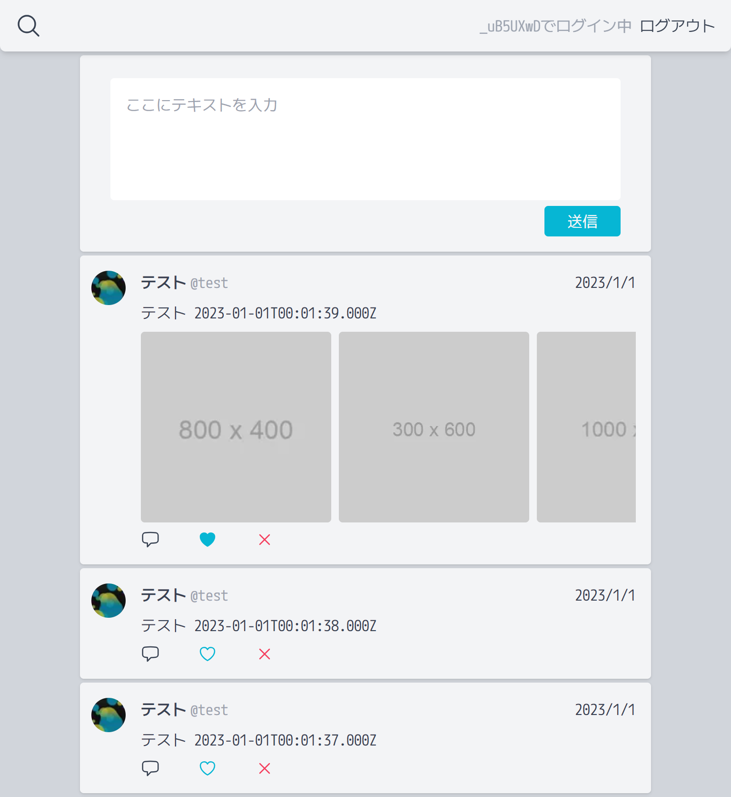
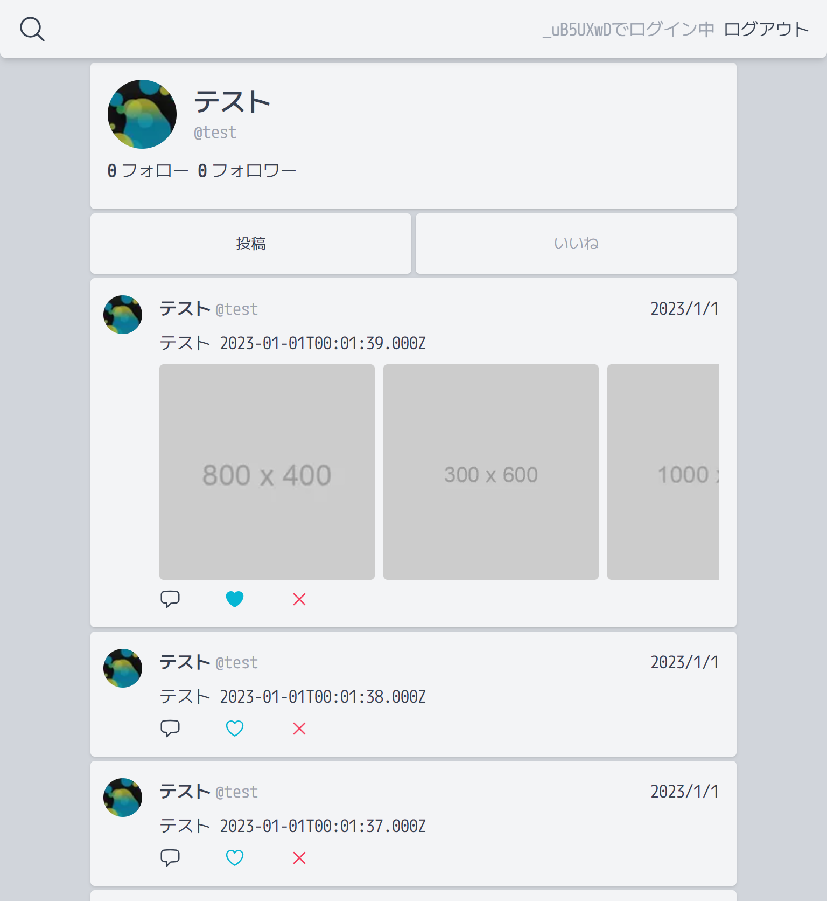

# Unsocial

　

## Deployment Steps

1. Click on Deploy on Railway
2. Click "Deploy Now"
3. Configure and save config
4. Click "Deploy"
5. Wait for the deployment to finish
6. Access `https://${automatically_generated_subdomain}.up.railway.app`

## Features

- Simple Deployment
- Login with a single account on the server
- Display Fediverse accounts
- Federate posts (replies), likes, reposts, and follows
- Registering relay servers
- Fewer features, lightweight, and low cost

## Supported ActivityPub Servers

- Misskey
- Mastodon

## Contributing

- [Documents](./docs)
