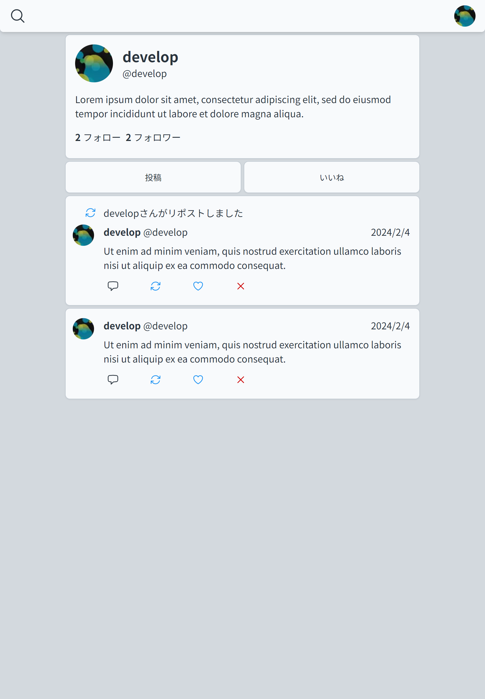
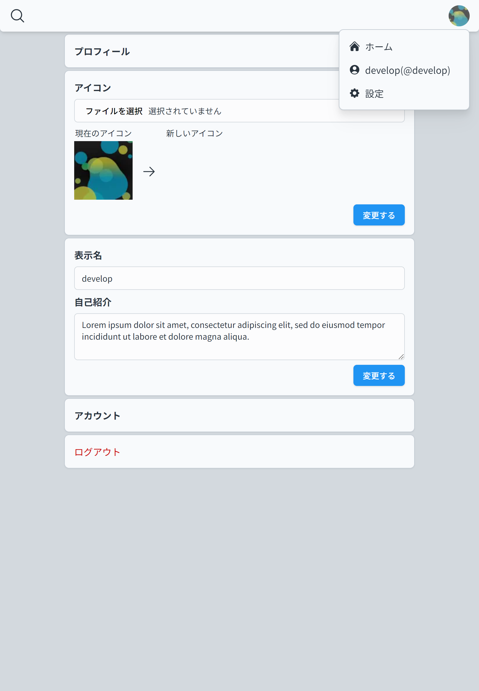

# Unsocial

　

Demo: https://unsocial.dev

## Deployment Steps

1. Click on Deploy on Railway
2. Click "Deploy Now"
3. Configure and save config
4. Click "Deploy"
5. Wait for the deployment to finish
6. Access `https://${automatically_generated_subdomain}.up.railway.app`

## Features

- Login
- User display
- Note display/posting/deletion
- Like/Unlike notes
- Follow/Unfollow
- Reply

## Supported ActivityPub Servers

- Misskey
- Mastodon

## Contributing

- [Documents](./docs)
